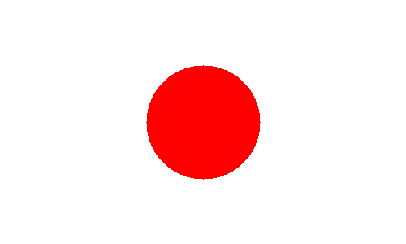
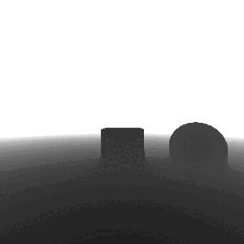

# Download:
To use the stable version:\
`git clone https://github.com/PiCake314/BitMap/tree/master`


To use the latest _unstable_ version:\
`git clone https://github.com/PiCake314/BitMap/tree/dev`


# Dependencies:
This library depends on 2 libraries:
- [ffmpeg](https://ffmpeg.org)
- [ImageMagick](https://imagemagick.org)

Make sure you have them installed before using Mapper.

# How to use:

- Move into the root dirctory of this project using the following command:\
`cd BitMap/`
- Put your code inside the `canvas` function inside the `BitMap/mains/sketch.hpp` directory (examples bellow).
- Compile and run your code by running one of the following commands:
    1. `make image filename=<output_filename.ppm> w=<width> h=<height>`
    2. `make video filename=<output_filename.mp4> w=<width> h=<height> fps=<fps>`
- Output:
    1. images should be in: `BitMap/output/ppms/`
    2. videos should be in: `BitMap/output/vids/`


# Example programs:
### Images
---
- Easy: **Japanese flag**

    The easiest image we can make is probably the Japanese flag. Copy and paste following code in the `canvas` function found in `BitMap/mains/sketch.hpp`:
    ```cpp
    m.drawCircle({}, 70, map::clr::RED, true, false, 2, map::Alignment::center);
    ```
    As you can see, it can be hard to decipher what each parameter means. So, alternatively, you can create a `map::shapes::Circle` object and past it to the generic `map::Mapper::draw` function (this is the prefered way):

    ```cpp
    auto circle = map::shapes::Circle({}, 70, {.color = map::clr::RED, .alignment = map::Alignment::center});
    m.draw(&circle);
    ```


    Now to create the image, run the following command:\
    `make image filename=japan.ppm h=300 w=500`

    To convert the image from a ppm into a png:\
    `make png filename=japan`
    
    The output image should look like this:
    - 

---

- Medium: **Star**

    To make a star, we need to calculate the position of the 5 mains points. Copy and paste following code in the `canvas` function found in `BitMap/mains/sketch.hpp`:
    ```cpp
    std::vector<map::Point> points;
    for(int i{}; i < 5; ++i){
        points.push_back({cos(2 * M_PI * i / 5), sin(2 * M_PI * i / 5)});
        points[i] *= 100; // scale to make it visible
        points[i] += {width / 2, height / 2}; // center the point
    }

    for(int i{}; i < 5; ++i){
        m.drawLine(points[i], points[(i + 2) % 5], map::clr::RGB{245, 191, 79});
    }
    ```
    Again, not very readable, so let's rewrite this using `map::shapes::Line` instead:

    ```cpp
    std::vector<map::Point> points;
    for(int i{}; i < 5; ++i){
        points.push_back({cos(2 * M_PI * i / 5), sin(2 * M_PI * i / 5)});
        points[i] *= 100;
        points[i] += {width / 2, height / 2};
    }

    std::vector<map::shapes::Line> lines;
    for(int i{}; i < 5; ++i){
        lines.push_back({points[i], points[(i + 2) % 5], {.color = {245, 191, 79}}});
    }

    
    for(auto& line : lines){
        m.draw(&line);
    }

    ```
    
    The `map::Mapper::draw` function can take a `std::vector<map::shapes::ShapePtr`>. That, combined with a little bit of refactoring, we get this:
    ```cpp
    using LineData = map::shapes::Line::Data;

    std::vector<map::shapes::ShapePtr> lines;
    for(int i{}; i < 5; ++i){
        int i2 = (i + 2) % 5;
        lines.push_back(
            std::make_unique<map::shapes::Line>(
                map::Point{cos(2 * M_PI * i / 5), sin(2 * M_PI * i / 5)} * 100 + map::Point{width / 2, height / 2},
                map::Point{cos(2 * M_PI * i2 / 5), sin(2 * M_PI * i2 / 5)} * 100 + map::Point{width / 2, height / 2},
                LineData{.color = {245, 191, 79}}
            )
        );
    }

    m.draw(lines);
    ```

    This is better than before. But it's stil a hassle to do all the `std::make_unique` calls ourselves. Instead of all of this, there is a dedicated `map::shapes::Polygon` class that we can use:
    ```cpp
    std::vector<map::Point> points;
    for(int i{}, j{}; i < 5; ++i, j += 2){
        points.push_back({cos(2 * M_PI * (j % 5) / 5), sin(2 * M_PI * (j % 5) / 5)});
        points[i] *= 100;
        points[i] += {width / 2, height / 2};
    }

    map::shapes::Polygon star{points, {.color = {245, 191, 79}}};

    m.draw(&star);
    ```
    
    It's better to use this class because now we have better control over this shape, such as having the option to fill it with color (I'll also change some math involved to make it more convenient):
    ```cpp
    
    std::vector<map::Point> points;
    for(int i{}; i < 10; ++i){
        double angle = i * 2 * M_PI / 10;
        double x = cos(angle);
        double y = sin(angle);
        if(i % 2 == 0){
            x *= .5;
            y *= .5;
        }
        points.push_back({int(x * 100 + width / 2), int(y * 100 + height / 2)});
    }

    map::shapes::Polygon star{points, {.color = {245, 191, 79}, .filled = true}};

    m.draw(&star);
    ```

    Now to create the image, run the following command:\
    `make image filename=star.ppm h=300 w=300`

    To convert the image from a ppm into a png:\
    `make png filename=star`
    
    The output image should look like this:
    - 

---

- Hard: **Ray Marching!**

    **Note that this is not a ray marching tutorial. This code was taken line by line from [this video](https://www.youtube.com/watch?v=khblXafu7i) by [kishimisu](https://www.youtube.com/@kishimisu).**\
    We'll start by defining some useful functions that will help us define our world:
    ```cpp
    double smoothMin(const double a, const double b, const double k){
        const double h = std::max(k - std::abs(a - b), 0.) / k;
        return std::min(a, b) - h * h * h * k * (1./6.);
    }

    double sphere(const map::Point3D& p, const double r){
        return p.mag() - r;
    }

    double cube(const map::Point3D& p, const map::Point3D& s){
        const map::Point3D d = p.abs() - s;
        return (d.max({0, 0, 0}) + map::Point3D{std::min(std::max(d.x, std::max(d.y, d.z)), 0.)}).mag();
    }
    ```
    Now we can define our world by caclulating the distance to the closest object:
    ```cpp
    double world(const map::Point3D& p){
        const map::Point3D s1_pos = {3, 0, 0};
        const auto sphere1 = sphere(p - s1_pos, 1);

        const auto box1 = cube(p, map::Point3D{.75});

        const double ground = - p.y + .75; // inverted because origin is at the top left

        return smoothMin(ground, smoothMin(sphere1, box1, 2), 1);
    }
    ```
    I want to make the camera rotate around the scene, so I'll add a timer _global_ variable:
    ```cpp
    double timer{};
    ```

    Now I will define the function that will be called for each pixel:
    ```cpp
    map::clr::RGB image(const map::Point& coord){
        const map::Point uv = (coord * 2. - map::Point{width, height}) / height;

        map::Point3D ro{0, -1, -5};      // ray origin
        map::Point3D rd = map::Point3D{uv.x, uv.y, 1}.normalized(); // ray direction

        double t{}; // distance

        ro.rotate<map::Point3D::Axis::Y>(timer); // rotating the camera
        rd.rotate<map::Point3D::Axis::Y>(timer); // rotating the ray direction

        // raymarching
        for(int i{}; i < 80; ++i){
            map::Point3D p = ro + rd * t; // position along the ray

            double d = world(p); // distance to the shape

            t += d; // marching...

            if(d < .001 || t > 100) break; // if we are close enough to the shape or if we are too far away, we stop
        }

        map::Point3D color = {t, t, t}; // creating grayscale image
        color *= 255; // rescaling (0-1) to (0-255)
        color *= .05; // the intensity of the depth (the higher the darker)

        return color;
    }
    ```

    Lastly, in the `canvas` function, we'll call the function on every pixel for every frame.:
    ```cpp
    void canvas(map::Mapper &m){
        using namespace map;
        using namespace shapes;

        const int frames = m.getFPS() * 2; // 2 seconds

        for(int frame{}; frame < frames; ++frame){
            for(int i = 0; i < height; ++i){
                for(int j = 0; j < width; ++j){
                    m[{j, i}] = image({j, i}); // calling the function for each pixel
                }
            }

            m.setState(); // updating the buffer
            m.saveFrame(); // saving the frame to a temporary file
            timer += double(2 * M_PI) / frames; // updating the timer
        }
    }
    ```
    Notice that this is also where incriment the timer.\
    \
    To create the video, run the following command:\
    `make video filename=ray_marching.mp4 h=300 w=300 fps=30`

    Keep in mind that this **will** be slow. Usually, ray marching is done on the GPU, not the CPU.\
    Final result should look something like this:
    - 

\
\
\
\
\
\

# TODO:
- [x] Fix readme IoI
- [ ] Fix shape includes in mapper header file
- [x] Implement multi-threading
- [ ] Implement triangle
- [x] Implement complex polygon
- [x] Add text
- [ ] Add image
- [ ] Implement multiple arg passing for Alignment
- [x] Deprecate unused functions/enums/structs